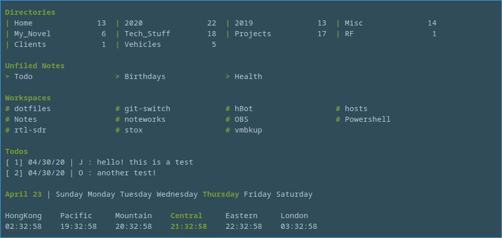

#<a name="top">My Dotfiles</a>
---

My "dotfile" collection.   Lots of prompt and environment customization for Bash and Vim along with a couple of legacy dotfiles that I keep around for historical reasons.

- [.zshrc](#.zshrc)
- [jkp.zsh-theme](#jkp.zsh-theme)
- [.bashrc](#.bashrc)
- [.bash_profile](#.bash_profile)
- [.colors](#.colors)
- [.emacs](#.emacs)
- [.git](#.git)
- [.gvimrc](#.gvimrc)
- [.screenrc](#.screenrc)
- [.vim](#.vim)

---
**<a name=".zshrc">.zshrc</a>**
- Now that MacOS (as of Catalina) has switched to ZSH as the default shell, I'm giving it a try, so to that end I've added my new zshrc to this repo.
- Includes improved note functions

**New ZSH Functions for Note Taking**

- Notes 
   1. **n**  -- By itself will create a note with today's date as the name of the note.  With an argument it will create a note with that name if it does not already exist.  If the argument is a directory, it will create the note with today's date as the name within the directory.  If the note already exists, it will open the existing note in $EDITOR
   2. **nl**  -- Lists all existing notes.  (Notes are created and stored in ~/Notes)
   3. **nv** <filename> -- view a particular note 
   4. **ns** <searchterm> -- uses grep to search all notes for the given search term

- Todos
  1. **td** -- Opens the Todo file for raw editing
  2. **td a** -- Add a new Todo
  3. **td c** -- Complete a Todo (Not Yet Implemented)
  4. **td d** -- Delete a Todo (Not Yet Implemented)
  5. **td l** -- List active Todos

- World Clock Display
  1. **cl** -- Display current time in various time zones with the local timezone highlighted
  

- Weekdays
  1. **pw** -- Print the current date and the weekdays with the current day highlighted
  

- Workspaces - where I keep things I'm currently working on
   1. **ws** -- By itself will list all directories under ~/Workspace.   With an argument it will change to that working directory and clear the screen

[-top-](#top)

---

**<a name="jkp.zsh-theme">jkp.zsh-theme</a>**
- Zsh theme that sets the prompt to include user, date, pwd and git status.  Prompt turns red when sudo'ed to root.

[-top-](#top)

---

**<a name=".bashrc">.bashrc</a>**

Bash prompt is colorized based on environment.  Servers in my current environment conform to a somewhat simple naming convention in that all names must start with the environment that they operate in.  This allows me to color code portions of my prompt based on my environment.  

Brackets and separators as follows:
- PROD/PRD - Red
- TEST/TST - Yellow
- DEV      - Green
- SAND     - Cyan
- Other    - White

*(FYI -- I added the dashes in the picture to obscure actual server names and although not shown here, if you sudo to a root shell, the user name changes to 'root' and is colorized red.)*

**bin/git-branch.pl**
- Perl snippet to show the git branch of the current directory (if it is under git control) and a nifty bit that gets rid of the error messages when git is not installed on a server.

OS Specific sections for some aliases and environment variables:
- Linux
- SunOS
- Darwin

**Aliases**
- Some nifty keyboard aliases to make common CLI strings a bit simpler to access, broken up by logical function

**Functions**
- Text Notes
   1. **n**  -- By itself will create a note with today's date as the name of the note.  With an argument it will create a note with that name if it does not already exist.  If the note already exists, it will open the existing note in $EDITOR
   2. **nls**  -- Lists all existing notes.  (Notes are created and stored in ~/Notes)

- Working with the Workspace
   1. **W** -- By itself will list all directories under ~/Workspace.   With an argument it will change to that working directory and clear the screen

Command logging to the PROMPT_COMMAND per https://spin.atomicobject.com/2016/05/28/log-bash-history/ is now enabled by default.

[-top-](#top)

---

**<a name=".bash_profile">.bash_profile</a>**
- simple redirect to my .bashrc

[-top-](#top)

---

**<a name=".gvimrc">.gvimrc</a>**
- Added a couple of nice features: 
   1. With a little help from [lmutracker](https://gist.github.com/Glavin001/76ffcca87b946aa0b550f3ca46cb) the background color (dark or light) now initializes based on the Macbook ambient light sensor.
   2. Mapped &lt;Leader&gt; b to enable on the fly switching from dark to light backgrounds.
   3. Mapped &lt;Leader&gt; z to toggle "Zen Mode" - a super simple distraction free full screen mode. 

- Added a left margin using "foldcolumn=2" (colorized to match the bg via zen.vim)

- Added a much improved status line

Uses the zen.vim colorscheme located in ~/.vim/colors

[-top-](#top)

---

**<a name=".vim">.vim</a>**
- Various vim plugins 

[-top-](#top)

---

**<a name=".emacs">.emacs</a>**
- an ancient dotfile that needs to be updated.  Mostly here for historical purposes.

---

[-top-](#top)

**<a name=".screenrc">.screenrc</a>**  
- Simple mode line and a few key bindings
- soon to be replaced w/tmux.  someday.  maybe.

[-top-](#top)

---

For more dotfiles head over to <a href="https://dotfiles.github.io">https://dotfiles.github.io</a>

---

=======
Last Updated: Sun 01 Mar 2020 04:26:32 PM CST
